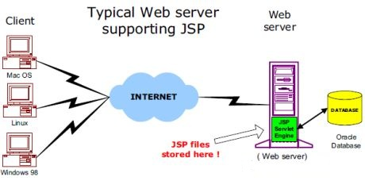

# JSP——体系结构

web 服务器需要一个 JSP 引擎，即处理 JSP 页面的容器。JSP 容器负责为 JSP 页面拦截请求。本教程使用了 Apache，Apache 已经内置了 JSP 容器来支持 JSP 页面开发。

JSP 容器适用于 Web 服务器，来提供 JSP 运行时环境和其他服务的需求。它知道如何理解 JSP 的部分特殊元素。

以下图表显示了 JSP 容器的位置以及在一个 Web 应用程序中的 JSP 文件。

## JSP 处理： 

下面的步骤解释了 web 服务器如何使用 JSP 创建 web 页面：

- 作为正常的页面，你的浏览器发送一个 HTTP 请求到 web 服务器。

- web 服务器承认一个 JSP 页面的 HTTP 请求，并将其转发给一个 JSP 引擎。这是通过使用 URL 或 JSP 页面实现的，该 JSP 页面是以**.jsp**结尾而不是以 .Html 结尾的。

- JSP 引擎从磁盘加载 JSP 页面并将其转换为一个 servlet 的内容。这种转换是非常简单的，所有模板文本转换为 println()语句，所有 JSP 元素转换为 Java 代码实现页面的相应的动态行为。

- JSP 引擎编译 servlet 到一个可执行的类中，并将原始请求转发给一个 servlet 引擎。

- 调用 servlet 引擎的 web 服务器的一部分加载 Servlet 类并执行它。执行期间，Servlet 产生一个 HTML 格式的输出，servlet 引擎将该输出传递到 HTTP 响应内的 web 服务器中。

- web 服务器将 HTTP 响应以静态 HTML 内容的形式转发到你的浏览器中。

- 最后 web 浏览器处理 HTTP 响应中的动态生成的 HTML 页面，就好像它是一个静态页面。

上述所有步骤如下图所示：

通常，JSP 引擎检查 JSP 文件的 servlet 是否已存在，JSP 的修改日期是否比 servlet 的过时。如果 JSP 的修改日期比其生成的 servlet 的修改日期过时，那么 JSP 容器假设 JSP 修改日期没有改变，且生成的 servlet 的修改日期仍然与 JSP 的内容相匹配。与其他脚本语言(比如 PHP)相比，这个过程更有效率，因此更加快速。

所以在某种程度上来说，一个 JSP 页面只是用另一种方式来写 servlet，而不需要成为一个 Java 编程奇才。除了翻译阶段，处理 JSP 页面完全就像处理一个普通的 servlet 一样。
