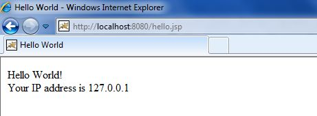

# JSP - 语法

本教程将给出涉及 JS P开发的语法的基本思想(即元素)。

## Scriptlet

scriptlet 可以包含任意数量的 JAVA 语言语句，变量或方法声明，或者在页面的脚本语言中有效的表达式。

下面是 scriptlet 的语法：

``` 
<% code fragment %>
```

你可以编写相当于上述语法的 XML，如下所示：

``` 
<jsp:scriptlet>
   code fragment
</jsp:scriptlet>
```

任何文本、HTML 标签或你编写的 JSP 元素必须在 scriptlet 之外。下面是 JSP 的第一个简单的例子：

<pre class="prettyprint notranslate">
&lt;html&gt;
&lt;head&gt;&lt;title&gt;Hello World&lt;/title&gt;&lt;/head&gt;
&lt;body&gt;
Hello World!&lt;br/&gt;
&lt;%
out.println("Your IP address is " + request.getRemoteAddr());
%&gt;
&lt;/body&gt;
&lt;/html&gt;
</pre>

**注：** 假设 Apache Tomca t安装在 C:\ apache-tomcat-7.0.2 中，并且你的环境是按照教程中的环境设置配置的。

让我们把上面的代码写入 JSP 文件中的 hello.jsp 中，并把这个文件放在 **C:\ apache-tomcat-7.0.2 \ webapps \ROOT** 中，并试图通过 http://localhost:8080 / hello.jsp 浏览它。这将产生以下结果：



## JSP 声明

JSP 声明声明了一个或多个变量或方法，你可以在 JSP 文件中的 Java 代码中使用。当你在 JSP 文件中使用变量或方法之前，你必须声明。

下面是 JSP 声明的语法：

``` 
<%! declaration; [ declaration; ]+ ... %>
```

你可以编写相当于上述语法的 XML，如下所示：

``` 
<jsp:declaration>
   code fragment
</jsp:declaration>
```

以下是 JSP 声明的一个简单的例子：

``` 
<%! int i = 0; %> 
<%! int a, b, c; %> 
<%! Circle a = new Circle(2.0); %> 
```

## JSP 表达式

JSP 表达式元素包含一个脚本语言表达式，该表达式被赋值，转换成一个字符串，并插入到表达式出现在 JSP 文件中的位置。

因为表达式的值转换为一个字符串，你可以在 JSP 文件中的文本的一行使用一个表达式，无论该文本是否是 HTML 标签标记。

根据 Java 语言规范，表达式元素可以包含任何有效的表达式，但你不能使用分号来结束一个表达式。

下面是 JSP 表达式的语法：

``` 
<%= expression %>
```

你可以编写相当于上述语法的 XML，如下所示：

``` 
<jsp:expression>
   expression
</jsp:expression>
```


以下是 JSP 表达式的简单的例子：

 
<pre>
&lt;html&gt; 
&lt;head&gt;&lt;title&gt;A Comment Test&lt;/title&gt;&lt;/head&gt; 
&lt;body&gt;
&lt;p&gt;
   Today's date: &lt;%= (new java.util.Date()).toLocaleString()%&gt;
&lt;/p&gt;
&lt;/body&gt; 
&lt;/html&gt; 
</pre>

这会生成如下所示结果：

```
Today's date: 11-Sep-2010 21:24:25
```


## JSP 注释

JSP 注释标志着 JSP 容器应该忽略的文本或语句。当你想要隐藏或“注释掉”JSP 页面的一部分时，JSP 注释非常有用。

下面是 JSP 注释的语法：

``` 
<%-- This is JSP comment --%>
```

以下是 JSP 注释的简单的例子：

<pre>
&lt;html&gt; 
&lt;head&gt;&lt;title&gt;A Comment Test&lt;/title&gt;&lt;/head&gt; 
&lt;body&gt; 
&lt;h2&gt;A Test of Comments&lt;/h2&gt; 
&lt;%-- This comment will not be visible in the page source --%&gt; 
&lt;/body&gt; 
&lt;/html&gt; 
</pre>
 

这将生成如下所示的结果：

<pre>
<h2>A Test of Comments</h2>  
</pre>


在一些情况下，有少量的特殊结构可以用来插入注释或字符，否则会被特殊对待。这里有一个总结：

<table class="table table-bordered">
<tr><th style="width:30%">语法</th><th>目的</th></tr>
<tr><td>&lt;%-- comment --%&gt;</td><td> JSP 注释。JSP 引擎会忽略。</td></tr>
<tr><td>&lt;!-- comment --&gt;</td><td> HTML 注释。浏览器会忽略。</td></tr>
<tr><td>&lt;\%</td><td>代表静态 <% 文字。</td></tr>
<tr><td>%\&gt;</td><td>代表静态 <% 文字。</td></tr>
<tr><td>\'</td><td>单引号属性，使用单引号。</td></tr>
<tr><td>\"</td><td>双引号属性，使用双引号。</td></tr>
</table>  

## JSP 指令

JSP 指令影响 servlet 类的总体结构。它通常具有以下形式：

``` 
<%@ directive attribute="value" %>
```

有三种指令标签：

<table class="table table-bordered">
<tr><th style="width:30%">指令</th><th>描述</th></tr>
<tr><td>&lt;%@ page ... %&gt;</td><td>定义 page-dependent 属性，比如脚本语言，错误页面和缓冲要求。</td></tr>
<tr><td>&lt;%@ include ... %&gt;</td><td>包括转换阶段的一个文件。</td></tr>
<tr><td>&lt;%@ taglib ... %&gt;</td><td>声明一个在页面中使用的标签库，包含自定义操作。</td></tr>
</table> 

我们会在独立的章节 [**JSP – Directives**](directives.htm) 中解释 JSP 指令。

## JSP 操作

JSP 操作使用 XML 语法结构来控制 servlet 引擎的行为。你可以动态地插入一个文件，重用 javabean 组件，将用户转到另一个页面，或为 Java 插件生成 HTML。

操作元素只有一个语法，因为它符合 XML 标准：

``` 
<jsp:action_name attribute="value" />
```

操作元素基本上是预定义的函数，有以下 JSP 操作：

<table class="table table-bordered">
<tr><th style="width:30%">语法</th><th>目的</th></tr>
<tr><td>jsp:include</td><td>当请求页面时，包含一个文件</td></tr>
<tr><td>jsp:useBean</td><td>发现或实例化一个 JavaBean </td></tr>
<tr><td>jsp:setProperty</td><td> JavaBean 的属性集</td></tr>
<tr><td>jsp:getProperty</td><td>将 JavaBean 的属性嵌入到输出中</td></tr>
<tr><td>jsp:forward</td><td>将请求转发给一个新页面</td></tr>
<tr><td>jsp:plugin</td><td>生成浏览器-特定代码，为 Java 插件创建 OBJECT 或 EMBED 标签</td></tr>
<tr><td>jsp:element</td><td>动态的定义 XML 元素</td></tr>
<tr><td>jsp:attribute</td><td>定义了动态定义的 XML 元素的属性</td></tr>
<tr><td>jsp:body</td><td>定义了动态定义 XM L元素的 body </td></tr>
<tr><td>jsp:text</td><td>用于在 JSP 页面和文档中编写模板</td></tr>
</table> 

我们将在单独的章节 [**JSP – Actions**](actions.htm) 中解释 JSP 操作。

## JSP 隐式对象

JSP 支持 9 个自动定义的变量，这也称为隐式对象。这些变量是：

<table class="table table-bordered">
<tr><th style="width:30%">对象</th><th>描述</th></tr>
<tr><td>request</td><td>这是与请求关联的 <b>HttpServletRequest</b> 对象。</td></tr>
<tr><td>response</td><td>这是与客户端响应关联的 <b>HttpServletResponse</b> 对象。</td></tr>
<tr><td>out</td><td>这是用于向客户端发送输出的 <b>PrintWriter</b> 对象。</td></tr>
<tr><td>session</td><td>这是与请求关联的 <b>HttpSession</b> 对象。</td></tr>
<tr><td>application</td><td>这是与应用程序上下文关联的 <b>ServletContext</b> 对象。</td></tr>
<tr><td>config</td><td>这是与页面关联的 <b>ServletConfig</b> 对象。</td></tr>
<tr><td>pageContext</td><td>这个封装特使用特定服务器的特性，如更高的性能 <b>jspwriter</b>。</td></tr>
<tr><td>page</td><td>这是 <b>this</b> 的一个简单的同义词，是用来调用由转换的 servlet 类定义的方法。</td></tr>
<tr><td>Exception</td><td> <b>Exception</b>对象允许指定的 JSP 访问异常数据。</td></tr>
</table> 

我们将在独立的章节 [**JSP - Implicit Objects**](implicit_objects.htm) 中解释 JSP 隐式对象。

## 控制流语句

JSP 提供了强有力的 Java 工具来嵌入到你的 web 应用程序中。你可以在 JSP 编程中使用所有的 API 和 Jave 构建块，包括决策语句、循环等。

## 决策的语句

**if…else** 块像普通的 Scriptlet 一样开始，但 Scriptlet 结束于包含在 Scriptlet 标签间的 HTML 文本每一行。

<pre class="prettyprint notranslate tryit">
&lt;%! int day = 3; %&gt; 
&lt;html&gt; 
&lt;head&gt;&lt;title&gt;IF...ELSE Example&lt;/title&gt;&lt;/head&gt; 
&lt;body&gt;
&lt;% if (day == 1 | day == 7) { %&gt;
      &lt;p&gt; Today is weekend&lt;/p&gt;
&lt;% } else { %&gt;
      &lt;p&gt; Today is not weekend&lt;/p&gt;
&lt;% } %&gt;
&lt;/body&gt; 
&lt;/html&gt; 
</pre>


这将产生如下所示的结果：

```
Today is not weekend
```

现在看看下面的 **switch…case** 块，使用 out.println()语句和内部 Scriptletas 编写，与上述例子有一点区别：

<pre>
&lt;%! int day = 3; %&gt; 
&lt;html&gt; 
&lt;head&gt;&lt;title&gt;SWITCH...CASE Example&lt;/title&gt;&lt;/head&gt; 
&lt;body&gt;
&lt;% 
switch(day) {
case 0:
   out.println("It\'s Sunday.");
   break;
case 1:
   out.println("It\'s Monday.");
   break;
case 2:
   out.println("It\'s Tuesday.");
   break;
case 3:
   out.println("It\'s Wednesday.");
   break;
case 4:
   out.println("It\'s Thursday.");
   break;
case 5:
   out.println("It\'s Friday.");
   break;
default:
   out.println("It's Saturday.");
}
%&gt;
&lt;/body&gt; 
&lt;/html&gt; 
</pre>


这将产生如下所示的结果：

```
It's Wednesday.
```

## 循环语句

你还可以在 Java 中使用循环块的三种基本类型来实现 JSP 编程：**for，while，和 do…while**

让我们看看下面的 **for** 循环的例子：

 
<pre>
&lt;%! int fontSize; %&gt; 
&lt;html&gt; 
&lt;head&gt;&lt;title&gt;FOR LOOP Example&lt;/title&gt;&lt;/head&gt; 
&lt;body&gt;
&lt;%for ( fontSize = 1; fontSize &lt;= 3; fontSize++){ %&gt;
   &lt;font color="green" size="&lt;%= fontSize %&gt;"&gt;
    JSP Tutorial
   &lt;/font&gt;&lt;br /&gt;
&lt;%}%&gt;
&lt;/body&gt; 
&lt;/html&gt; 
</pre>


这将产生如下所示的结果：

 
<pre>
   <font color="green" size="1">
    JSP Tutorial
   </font><br />
    <font color="green" size="2">
    JSP Tutorial
   </font><br />
    <font color="green" size="3">
    JSP Tutorial
   </font><br />
</pre>


 
上述例子也可以用 **while** 循环来编写：

<pre>
&lt;%! int fontSize; %&gt; 
&lt;html&gt; 
&lt;head&gt;&lt;title&gt;WHILE LOOP Example&lt;/title&gt;&lt;/head&gt; 
&lt;body&gt;
&lt;%while ( fontSize &lt;= 3){ %&gt;
   &lt;font color="green" size="&lt;%= fontSize %&gt;"&gt;
    JSP Tutorial
   &lt;/font&gt;&lt;br /&gt;
&lt;%fontSize++;%&gt;
&lt;%}%&gt;
&lt;/body&gt; 
&lt;/html&gt; 
</pre>


这也会产生如下所示的结果：


 
<pre class="result notranslate">
   <font color="green" size="1">
    JSP Tutorial
   </font>
    <font color="green" size="2">
    JSP Tutorial
   </font>
    <font color="green" size="3">
    JSP Tutorial
   </font>
</pre>


## JSP 运算符

JSP 支持所有 Java 支持的逻辑和算术运算符。下表列出了所有运算符的优先级，从上到下，优先级依次降低。

在一个表达式，优先级越高的运算符会越先计算。

<table class="table table-bordered">
<tr> <th>类型&nbsp;</th> <th>运算符&nbsp;</th>
<th>结合性&nbsp;</th> </tr> <tr> <td>后缀运算符&nbsp;</td>
<td>() [] . (dot operator)</td> <td>从左到右&nbsp;</td> </tr> <tr> <td>一目运算符&nbsp;</td> 
<td>++ - - !  ~ </td> <td>从右到左&nbsp;</td>
</tr> <tr> <td>倍数运算符&nbsp;</td> <td>*  /  %&nbsp;</td>
<td>从左到右&nbsp;</td> </tr> <tr> <td>加法运算符&nbsp;</td>
<td>+  -&nbsp;</td> <td>从左到右&nbsp;</td> </tr>
<tr> <td>位移运算符 &nbsp;</td> <td>&gt;&gt; &gt;&gt;&gt; &lt;&lt; &nbsp;</td> <td>从左到右&nbsp;</td> </tr> <tr> <td>代数运算符&nbsp;</td>
<td>&gt; &gt;=  &lt; &lt;= &nbsp;</td> <td>从左到右&nbsp;</td> </tr>
<tr> <td>赋值运算符 &nbsp;</td> <td>==  !=&nbsp;</td> <td>从左到右&nbsp;</td> </tr> <tr> 
<td>按位与运算符&nbsp;</td>
<td>&amp;&nbsp;</td> <td>从左到右&nbsp;</td> </tr> <tr> <td>按位异或运算符&nbsp;</td> <td>^&nbsp;</td> <td>从左到右&nbsp;</td>
</tr> <tr> <td>按位或运算符&nbsp;</td> <td>|&nbsp;</td> <td>从左到右 &nbsp;</td> </tr> <tr> <td>逻辑与运算符&nbsp;</td>
<td>&amp;&amp;&nbsp;</td> <td>从左到右&nbsp;</td> </tr> <tr>
<td>逻辑或运算符&nbsp;</td> <td>||&nbsp;</td> <td>从左到右&nbsp;</td> </tr> <tr> <td>条件运算符&nbsp;</td>
<td>?:&nbsp;</td> <td>从右到左&nbsp;</td> </tr> <tr>
<td>赋值运算符&nbsp;</td> <td>=  +=  -=  *=  /=  %=
&gt;&gt;=  &lt;&lt;=  &amp;=  ^=   |=&nbsp;</td> <td>从右到左&nbsp;</td>
</tr> <tr> <td>逗号运算符&nbsp;</td> <td>,&nbsp;</td> <td>从左到右 &nbsp;</td> </tr> </table> 
 
## JSP 文字

JSP 表达式语言定义了以下文字：

- **Boolean：** true and false

- **Integer：** 与 Java 相同

- **Floating point：** 与 Java 相同

- **String：** 带有单引号和双引号；’’转义为\’’，’转义为\’，\转义为\\。

- **Null：** null
